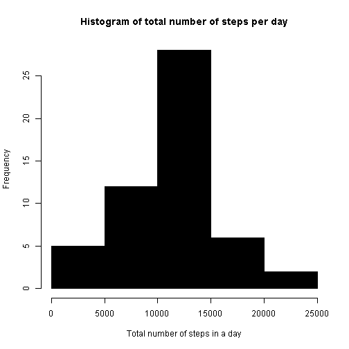

<p>JHU on Coursera<br>
Reproducible Research Peer Assessment 1
====================================================================================
Loading and preprocessing the data. Show any code that is needed to:<br>
1.Load the data <br>
2.Process/transform the data (if necessary) into a format suitable for your analysis


```r
# Data Source: https://d396qusza40orc.cloudfront.net/repdata%2Fdata%2Factivity.zip

# use ggplot2 library

library(ggplot2)

# Read the data file
if (!file.exists("activity.csv")) {
    unzip("activity.zip")
}
dsActivity <- read.csv("activity.csv")
```
What is mean total number of steps taken per day?<br>
<br>
For this part of the assignment, you can ignore the missing values in the dataset.<br>
1.Make a histogram of the total number of steps taken each day.<br>
2.Calculate and report the mean and median total number of steps taken per day.


```r
# generate data frame without na; complete cases only
dataFrame <- na.omit(dsActivity )

# aggregate steps as per date to get total number of steps in a day
aggre_table_date_steps <- aggregate(steps ~ date, dataFrame, sum)

# create histogram of total number of steps in a day
hist(aggre_table_date_steps$steps, col=1, main="Histogram of total number of steps per day", 
     xlab="Total steps each day")
```

 

```r
# find the mean and median total number of steps per day
mean(aggre_table_date_steps$steps)
```

```
## [1] 10766
```

```r
## [1] mean = 10766

median(aggre_table_date_steps$steps)
```

```
## [1] 10765
```

```r
## [1] median=10765
```

What is the average daily activity pattern?<br>
1.Make a time series plot (i.e.  type = "l" ) of the 5-minute interval (x-axis) and the average number of steps taken, averaged across all days (y-axis)<br>
2. Which 5-minute interval, on average across all the days in the dataset, contains the maximum number of steps?


```r
# aggregate steps first to get average number of steps in an interval
table_interval_steps <- aggregate(steps ~ interval, dataFrame, mean)

# generate the line plot of the 5-minute interval (x-axis) and the average number of 
# steps taken, averaged across all days (y-axis)
plot(table_interval_steps$interval, table_interval_steps$steps, type='l', col=1, 
     main="Average number of steps averaged over all days", xlab="Interval", 
     ylab="Average number of steps")
```

 

```r
#getting the row id of max average number of steps in an interval
max_ave_steps_row_id <- which.max(table_interval_steps$steps)

# get the interval with maximum average number of steps in an interval
table_interval_steps [max_ave_steps_row_id, ]
```

```
##     interval steps
## 104      835 206.2
```

```r
##     interval steps
## 104    835 206.2
# The interval 835 has the maxaverage number of steps 206.2.
```
Imputing missing values<br>

Note that there are a number of days/intervals where there are missing values (coded as NA). The presence of missing days may introduce bias into some calculations or summaries of the data.<br>
1.Calculate and report the total number of missing values in the dataset (i.e. the total number of rows with NAs)<br>

2.Devise a strategy for filling in all of the missing values in the dataset. The strategy does not need to be sophisticated. For example, you could use the mean/median for that day, or the mean for that 5-minute interval, etc.<br>

3.Create a new dataset that is equal to the original dataset but with the missing data filled in.
<br>
4.Make a histogram of the total number of steps taken each day and Calculate and report the mean and median total number of steps taken per day. Do these values differ from the estimates from the first part of the assignment? What is the impact of imputing missing data on the estimates of the total daily number of steps?


```r
#rows with NA's
dataFrame_NA <- dataFrame[!complete.cases(dsActivity),]

# number of rows
nrow(dataFrame_NA)
```

```
## [1] 2304
```

```r
# The total number of rows with NA is 2304 

# Strategy: Simple replace the NA by the mean for the 5 minute interval using table_interval_steps

for (i in 1:nrow(dataFrame)){
  if (is.na(dataFrame$steps[i])){
    interval_val <- df$interval[i]
    row_id <- which(table_interval_steps$interval == interval_val)
    steps_val <- table_interval_steps$steps[row_id]
    df$steps[i] <- steps_val
  }
}

# aggregate steps to get total number of steps in a day
table_date_steps_imputed <- aggregate(steps ~ date, dataFrame, sum)

# create histogram of total number of steps in a day
hist(table_date_steps_imputed$steps, col=1, main="Histogram of total number of steps per day", xlab="Total number of steps in a day")
```

 

```r
# mean and median of total number of steps per day
mean(table_date_steps_imputed$steps)
```

```
## [1] 10766
```

```r
## [1] 10766

median(table_date_steps_imputed$steps)
```

```
## [1] 10765
```

```r
## [1] 10766

#mean and median of total number of steps per day for data with without NA
mean(aggre_table_date_steps$steps)
```

```
## [1] 10766
```

```r
## [1] 10766

median(aggre_table_date_steps$steps)
```

```
## [1] 10765
```

```r
## [1] 10765
```

Are there differences in activity patterns between weekdays and weekends?<br>
For this part the  weekdays()  function may be of some help here. Use the dataset with the filled-in missing values for this part. <br>
1. Create a new factor variable in the dataset with two levels -- "weekday" and "weekend" indicating whether a given date is a weekday or weekend day.<br>

2.Make a panel plot containing a time series plot (i.e.  type = "l" ) of the 5-minute interval (x-axis) and the average number of steps taken, averaged across all weekday days or weekend days (y-axis). The plot should look something like the following, which was creating using simulated data:
<br>

```r
# convert date from string to Date class
dataFrame$date <- as.Date(dataFrame$date, "%Y-%m-%d")

# add a new column indicating day of the week 
dataFrame$day <- weekdays(dataFrame$date)

# add a new column called day type and initialize to weekday
dataFrame$day_type <- c("weekday")

# make day_type as weekend if Sat and Sun
for (i in 1:nrow(dataFrame)){
  if (dataFrame$day[i] == "Saturday" || dataFrame$day[i] == "Sunday"){
    dataFrame$day_type[i] <- "weekend"
  }
}

# convert day_time from character to factor
dataFrame$day_type <- as.factor(dataFrame$day_type)

# aggregate steps as interval to get average number of steps in an interval across all days
table_interval_steps_imputed <- aggregate(steps ~ interval+day_type, dataFrame, mean)

# generate panel plot
qplot(interval, steps, data=table_interval_steps_imputed, geom=c("line"), xlab="Interval", 
      ylab="Number of steps", main="") + facet_wrap(~ day_type, ncol=1)
```

 
